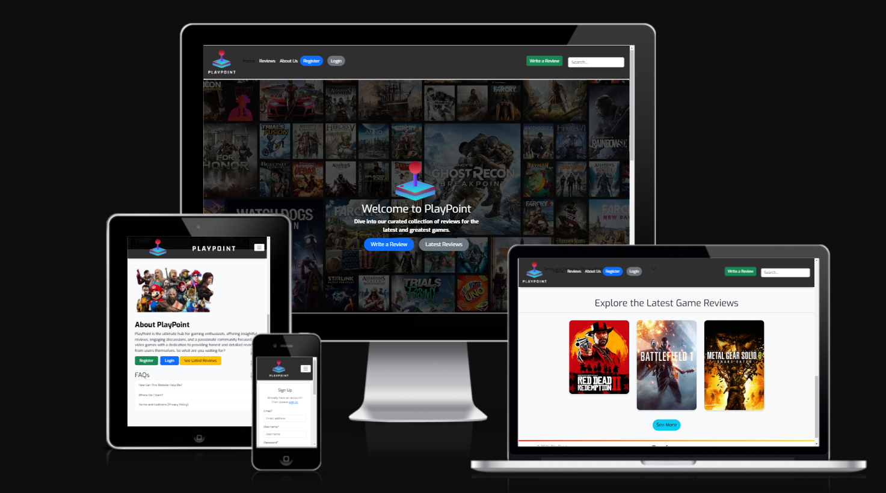

# PlayPoint 🎮

## Overview

To View the live project click here - [PlayPoint](https://playpoint-blog-app-v2-e446459e072b.herokuapp.com/)

### Introduction

PlayPoint is a web-based platform designed to provide simple functionality for game reviews. The platform transforms the gaming experience by allowing users to share their opinions, review games, and interact with other gamers' content, creating an engaging and informative environment for the gaming community.

### Navigation

- [Overview](#overview)
- [Objective](#objective)
- [Target Audience](#target-audience)
- [Benefits Offered](#value-user)
- [User Needs Addressed](#user-needs-addressed)
- [UX Design Process](#ux-design-process)
- [Features](#features)
- [Testing](#testing)
- [Deployment](#deployment)
- [Credits](#credits)

Goals

1. **Encourage Game Reviews**: By implementing a user-friendly review system, the platform encourages users to share their gaming experiences.
2. **Foster Community Interaction**: Create a space where gamers can comment on reviews, fostering discussion and community engagement.
3. **Provide Game Ratings**: Develop a rating system that allows users to quickly assess game quality through numerical scores.
4. **Offer Accessible Information**: Create a platform where both registered and unregistered users can access game reviews and ratings.

Value to user

- Transforms individual gaming experiences into shared knowledge
- Provides a platform for gamers to voice their opinions and read others'
- Creates a structured system for rating and reviewing games
- Offers a community-driven approach to game assessment
- Delivers a simple, streamlined experience focused on game reviews and ratings

### Target Audience

Casual Gamers

- Age Range: 13+ years old
- Gaming Experience: Beginner to intermediate gamers
- Motivation: Seeking game recommendations and community opinions

Hardcore Gamers

- Looking for in-depth game reviews
- Interested in sharing their own gaming experiences
- Want to engage in discussions about games
- Value detailed critiques and numerical ratings

Game Developers

- Seeking user feedback on their games
- Interested in community reception of their titles
- Want to track user ratings and reviews

Gaming Enthusiasts

- Enjoy reading and writing about games
- Like to compare their opinions with others
- Appreciate a platform to express their views on games

### How does this benfit the user?

Informed Decision Making

- Access to user-generated reviews and ratings
- Diverse perspectives on games
- Helps in making purchase decisions

Community Engagement

- Ability to share personal gaming experiences
- Opportunity to comment on others' reviews
- Sense of belonging to a gaming community

Game Discovery

- Exposure to new and popular games
- User ratings to quickly gauge game quality
- Detailed reviews for in-depth understanding

Accessibility

- Simple, user-friendly interface
- Clear rating system
- Easy review submission process

### User Needs Addressed:

- Need for a platform to share gaming experiences
- Desire for community-driven game recommendations
- Want for a structured game rating system
- Interest in engaging with other gamers' opinions
- Requirement for simple, straightforward game review access

The aim of this web app is to specifically address the growing need for user-generated content in the gaming industry while maintaining a focus on simplicity and user engagement. By combining game reviews with a comment system and community interaction, PlayPoint offers great value for gamers looking for an accessible and community-driven platform to share and explore game opinions and reviews.

## UX Design Process

### Strategy Plane

User Stories

### Must Have Features

#### <ins>Review Management</ins>

**User Story:** As a site user, I can view a paginated list of game reviews so that I can select which game review I want to read.

Acceptance Criteria:

- Given more than one review in the database, these multiple reviews are listed
- When a user opens the main page a list of reviews is seen
- The user sees all review titles with pagination to choose what to read

#### <ins>Review Creation</ins>

**User Story:** As a registered user I can submit my game review so that I can share my opinion

Acceptance Criteria:

- User can input game title, review text, rating, game image (cover art) and genre
- Submission process:
  - Confirms submission success
  - Displays the new review
- User can update and delete their own reviews

#### <ins>User Authentication</ins>

**User Story:** As a registered user I can log into my account so that I can access my review history and profile

Acceptance Criteria:

- User can log in using username and password

**User Story:** As a new user I want to register for an account so that I can create reviews and comment on others

Acceptance Criteria:

- User can create account using email and password
- Profile is automatically created upon registration
- Password must meet minimum security requirements:
  - At least 8 characters

#### <ins>Responsive Design</ins>

**User Story:** As a user I want the site to be responsive so that I can use it on any device

Acceptance Criteria:

- Site is usable on desktop, tablet, and mobile devices
- Layout adjusts appropriately to different screen sizes

#### <ins>Accessibility</ins>

**User Story:** As a User I require the site to be accessible so that I can utilize the website fully, regardless of potential visual impairments

Acceptance Criteria:

- Color contrast, fonts, images and screen reading capabilities adhered to
- Good use of semantic elements

#### <ins>Rating System</ins>

**User Story:** As a user I want to rate games so that I can quickly express my opinion

Acceptance Criteria:

- Rating system:
  - Scale of 1 to 10
  - Visual representation (e.g., 7/10)
- System must:

  - Display individual ratings

- Rating details include:
  - Date
  - User who rated ( registered)

### Should Have Features

#### <ins>Comment System</ins>

**User Story:** As a registered user I want to comment on reviews so that I can engage in discussions about games

Acceptance Criteria:

- Comments show:
  - User name
  - Date and time posted
  - Comment text
- Privacy:
  - Only registered users can comment
  - Users can edit or delete their own comments
  - comment are only visible to other user once approved

#### <ins>Search Functionality</ins>

**User Story:** As a user I want to search for game reviews so that I can find specific games quickly

Acceptance Criteria:

- Search bar accessible from all pages
- Search by game title, genre, or keywords
- Results display relevant reviews and ratings

### Could Have Features

#### <ins>User Profiles</ins>

**User Story:** As a User I want a profile page so that I can view my activity and manage my content

Acceptance Criteria:

- Users can:
  - View their submitted reviews
  - See their comment history
  - Edit personal information
- Profile features:
  - Avatar upload
  - Bio section
  - List of personal made game reviews

#### <ins>Game Categories</ins>

**User Story:** As a user I want to browse reviews by game category so that I can discover games in my preferred genres

Acceptance Criteria:

- Categories include popular genres (e.g., RPG, FPS, Strategy)
- Users can filter reviews by category
- Category pages show top-rated games within that genre

### Scope Plane

Core Features:

- User authentication
- Role based login and features
- Game review creation and management
- Comment creation and functionality
- CRUD Functionality
- Rating system
- Responsive design

### Structure Plane

Logical structure

The application follows a logical structure where users can:

- Register/Login to access their personal profile dashboard
- Create, read, update, and delete game reviews
- Rate games and view average ratings
- Comment on reviews (if registered)
- Browse reviews by game or genre

### Skeleton Plane

#### Wireframes

Desktop

[Include desktop wireframe images here]

Mobile

[Include mobile wireframe images here]

Tablet

[Include tablet wireframe images here]

Database Schema

[Include database schema image here]

### Surface Plane

#### Design Choices

Colour Scheme

[Include color palette image and description here]

Typography

[Include typography choices and descriptions here]

Design Principles

##### 1. Clarity

- Clean layouts with ample white space
- Clear visual hierarchy
- Intuitive navigation

##### 2. Consistency

- Consistent colour usage across all pages
- Standardised spacing and alignment
- Uniform interactive elements

##### 3. Accessibility

- High contrast text-to-background ratios
- Clear focus states for navigation
- Readable font sizes and line heights

##### 4. Responsiveness

- Fluid typography scaling
- Flexible grid system
- Mobile-first approach to layout

This design system creates an engaging, modern interface that encourages user interaction while maintaining excellent usability and accessibility standards.

## Features

[Include PlayPoint logo image here]

Home Page

1. Welcome Section - Introduces the platform, emphasizing community-driven game reviews.
2. Call-to-Action - Encourages visitors to sign up or log in to start reviewing games.
3. Featured Reviews - Showcases popular or recent game reviews.
4. About Us - Highlights the mission of creating a user-friendly game review platform.
5. Key Benefits - Explains the rating system, community engagement, and review features.

[Include home page screenshot here]

User Authentication

1. Sign-Up Functionality - Users can create accounts to access features like reviewing games and commenting.
2. Login System - Secure login allows users to access their dashboard and manage their content.
3. Login Status - In the top right, the status of user is displayed.
4. Role Based functionality - Admin panel link only available when signed in as a superuser.
5. User Messages - Message pop-ups giving users further clarification on completed actions for all user authentication processes.

[Include sign-up, login, and user dashboard screenshots here]

About Page

1. Platform Mission - Highlights the goal of creating a community-driven game review platform.
2. Community Focus - Emphasizes building a network of gamers who share opinions and experiences.
3. Inspiration - Explains the origins and purpose behind the creation of PlayPoint.
4. Contact Form - Provides a form for users to reach out with questions or suggestions.

[Include about page and contact form screenshots here]

Review Management

1. Available Reviews - Pagination for available game reviews for users to browse, accessible from the navigation.
2. Review Details - Review overview including game title, author, rating, and full text.
3. Rating Display - Clear visual representation of the game's rating.
4. Comments Section - Displays user comments and allows registered users to add their own.
5. CRUD Functionality - Authenticated users can create, read, update, and delete their own reviews.

[Include review list, individual review, and CRUD function screenshots here]

Search and Categories

1. Search Bar - Allows users to search for games or reviews by title, genre, or keyword.
2. Category Navigation - Provides easy access to reviews sorted by game genres or categories.
3. Search Results - Displays relevant reviews based on user search queries.

[Include search bar and category navigation screenshots here]

## Testing

## Deployment

## Credits

[List any resources, tutorials, or inspirations used in the development of PlayPoint]
