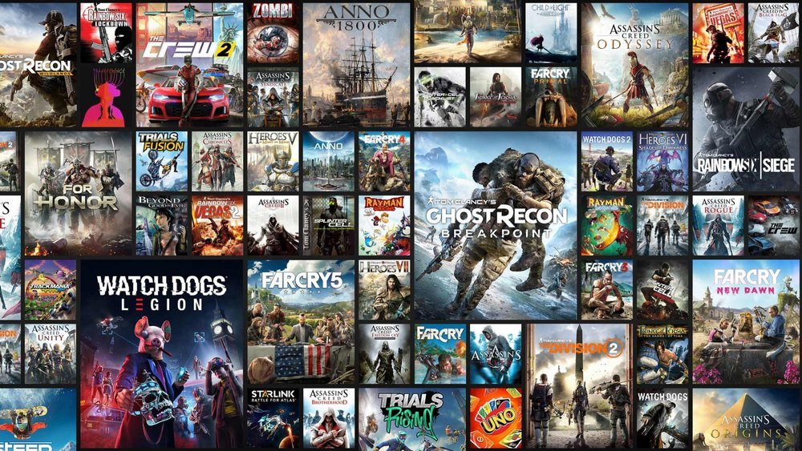
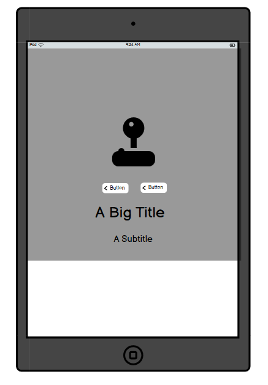
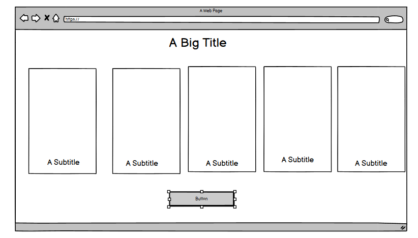

# Playpoint


## Introduction

Playpoint is a website that aims to keep users informed about the latest game releases through community interaction. The webiste allows users to write game reviews, comment on other users game reviews as well as create and update their own personal profile. 

I developed this website as part of the Code Institute’s Full-Stack Developer Bootcamp course and it is my final Hackathon project - focusing on a Django framework, database manipulation, CRUD functionality, and working as a team using agile methodologies. This project is for educational purposes only.

View the live site here: [Playpoint](https://playpoint-blog-app-v2-e446459e072b.herokuapp.com/)

For admin access with relevant sign-in information: [Playpoint Admin](https://playpoint-blog-app-v2-e446459e072b.herokuapp.com/admin/login/?next=/admin/)

<hr>

## Table of Contents

- [Playpoint](#playpoint)
- [Introduction](#introduction)
- [Table of Contents](#table-of-contents)
- [Overview](#overview)
- [UX - User Experience](#ux---user-experience)
  - [Colour Scheme](#colour-scheme)
  - [Font](#font)
- [Project Planning](#project-planning)
  - [Strategy Plane](#strategy-plane)
  - [Site Goals](#site-goals)
  - [Agile Methodologies - Project Management](#agile-methodologies---project-management)
  - [MoSCoW Prioritization](#moscow-prioritization)
  - [User Stories](#user-stories)
  - [Visitor User Stories](#visitor-user-stories)
- [Scope Plane](#scope-plane)
- [Structural Plane](#structural-plane)
- [Skeleton & Surface Planes](#skeleton--surface-planes)
  - [Wireframes](#wireframes)
  - [Database Schema - Entity Relationship Diagram](#database-schema---entity-relationship-diagram)
- [Security](#security)
- [Features](#features)
  - [User View - Registered/Unregistered](#user-view---registeredunregistered)
  - [CRUD Functionality](#crud-functionality)
- [Feature Showcase](#feature-showcase)
- [Future Features](#future-features)
- [Technologies & Languages Used](#technologies--languages-used)
  - [Libraries & Frameworks](#libraries--frameworks)
  - [Tools & Programs](#tools--programs)
- [Testing](#testing)
- [Deployment](#deployment)
  - [Connecting to GitHub](#connecting-to-github)
  - [Django Project Setup](#django-project-setup)
  - [Cloudinary API](#cloudinary-api)
  - [PostgreSQL from Code Institute](#postgresql-from-code-institute)
  - [Heroku deployment](#heroku-deployment)
- [Credits](#credits)
  - [Content References](#content-references)
  - [Media References](#media-references)
  - [Acknowledgements](#acknowledgements)

## Overview

Playpoint is a website designed to keep users informed of the latest game releases and allow for general discussion between users. Users are invited to:

- Join the Playpoint community
- create an account and update your profile.
- Interact with review posts through the comments section

Playpoint is accessible via all browsers with full responsiveness on different screen sizes. My aim is to create a space where users can read about upcoming events and provide comments about their own experiences. The goal of the site is to support these events and drive customers to them where possible via positive event posts.

## UX - User Experience

### Colour Scheme

The idea of the website is to have reviews posted for people to view. The colour scheme used was to create a modern and minimal design.

the colour for the header is Dark Grey rgb(47, 47, 47)

The colour throughout the entire website is white (#f9fafc)

font colour is normal black and white, with certain text (i.e navbar) having a cyan (#10B981) colour when hovered over.

### Font

The font style I used throughout the entire website was Exo


## Project Planning

### Strategy Plane

My project goal was to build a simple website showcasing game reviews with the option to have a dynamic conversation about the game using the comments section. My intention is to create a community/hub for gamers to openly express and share their thoughts on a partciular game.

### Site Goals

- Create an environment where people could discuss video games through reviews and comments.
- Easy UI for quick fulfilment of feature CRUD functionalities.
- UX remains the same whether on mobile, tablet, or desktop.

## Agile Methodologies - Project Management

Playpoint is my third project following Agile planning methods. I used the [GitHub Projects Board](https://github.com/users/Yazhmd/projects/3/views/1) to plan and document all my work.


### MoSCoW Prioritization

I chose to follow the MoSCoW Prioritization method for Playpoint, identifying and labelling the:

- **Must Haves**: The 'required', critical components of the project. Completing my 'Must Haves' helped me reach the MVP (Minimum Viable Product) for this project early, allowing me to develop further than originally planned.
- **Should Haves**: Components that are valuable to the project but not absolutely 'vital' at the MVP stage. The 'Must Haves' must receive priority over the 'Should Haves'.
- **Could Haves**: Features that are a 'bonus' to the project; it would be nice to have them in this phase, but only if the most important issues have been completed first and time allows.
- **Won't Haves**: Features or components that either no longer fit the project's brief or are of very low priority for this release.

## User Stories

User stories and features recorded and managed on my [GitHub Projects Board](https://github.com/users/Yazhmd/projects/3/views/1).

### User Stories Key

| Color | Priority        | MoSCoW Priority Description                                                 |
|:-----:|:----------------|:----------------------------------------------------------------------------|
|  🟢   | **Must Have**   | Essential/mandatory elements that must be included on the project           |
|  🟡   | **Should Have** | Important elements that should only be included with careful consideration. |
|  🟠   | **Could Have**  | Desirable elements that could be included if resources and time allow.      |
|  🔴   | **Won't Have**  | Elements that are **out-of-scope**.                                         |

|                Title                | User Story                                                                                                                                                                                            | MoSCoW |
|:-----------------------------------:|:------------------------------------------------------------------------------------------------------------------------------------------------------------------------------------------------------|:------:|
| User Story: Registration and login  | As a user, I can register and login on the website allowing me to write a review                                                                                                                      |   🟢   |
| User Story: User profile Dashboard  | As a Registered User, I can login to my profile page dashboard which allows me to create, edit or delete a review/comment and edit my personal details and login information.                         |   🟡   |
|       Open and Write a Review       | A registered user, can open a review/blog post about the game that they want to review.                                                                                                               |   🟢   |
| User Stories: Viewing Review Posts  | As a user I can view anyone blog post even if I am not registered/signed in                                                                                                                           |   🟢   |
|    User Story: Responsive Design    | As a user I can view and use the website on any of my devices (e.g laptop, phone or tablet)                                                                                                           |   🟢   |
|     User Story: Main Home Page      | As a Site Admin, I can update the home page whenever I want to update users on the latest news or features that they can access.                                                                      |   🟢   |
|    User Story: Comments (admin)     | As an admin, I can approve, deny or even discard a registered users' comments, resources (links) and media (photos and videos) based on the community safeguarding and TOS (terms of service) policy. |   🟢   |
| User Story: Dashboard Customization | As a user I can customize the theme and configuration of my dashboard to my liking.                                                                                                                   |   🟠   |
|     User Story: Liking a review     | As a registered user, I can like a review that I believed to be informative and helpful.                                                                                                              |   🟠   |
|  User Story: Website Customization  | As a user, I can customize the theme of the website (e.g dark mode) to my liking.                                                                                                                     |   🔴   |
|     User Story: Game Wish List      | As a User, I should be able to compile a selection of games that allow me to create a list of games that I may want to purchase and play late on.                                                     |   🔴   |

## Scope Plane

As I would be both learning/building the project using technologies that were still relatively new to me, such as Django, SQL, Bootstrap, and Cloudinary, I remianed cautious to maintain consistent control over the scope of the project and not let the idea become too overly cumbersome. I needed to finish project features early so as not to lose track of the MVP. Following Agile Planning Methodologies, I added User Stories as issues on my GitHub Project Board to keep the flow of the project in check.

Essential features of my project were:

- An accessible website that fulfills user needs
- Responsive website for users of mobile, tablet, and desktop devices
- User Authentication, sign in and registration
- Review, Comment and profile feature with full CRUD functionality

Planning thoroughly from the start allowed me to identify areas of importance for MVP completion and satisfaction of assessment criteria while balancing them with feature feasibility.

## Structural Plane

From initial concept through to the finalised project, I opted to use standard navigation elements to keep with the theme of familiarity. Bootstrap was used to help control flexibility across multiple screen sizes.

## Skeleton & Surface Planes

### Logo and Hero images


This was made using Design.com, the design of the playpoint logo is a simple joystick which is consitent with the gaming theme and colour that were chosen to make the logo visually appealing.

#### Main hero image



The main hero image is from (https://www.indiamart.com/proddetail/pc-game-22881473891.html).
I liked the design of this image as it definitley gave a gaiming aesthetic with multiple game cover arts featured on the jumbotron. 

#### Secondary hero image


The secondary hero image, down on the about section in the main homepage, is from (https://www.reddit.com/r/IrelandGaming/comments/14nvix3/what_video_game_franchise_would_make_you/). This reddit post I found had these ideal image that I decided I wanted to use. It has iconic game characters that adds to the general them of the website that I liked.


<details open>
<summary> Default profile pic</summary>


This picture was taken from (https://www.shutterstock.com/search/default-user). It was the ideal default profile picture to use for when a user initially signs up.

</details>


### Wireframes

The wireframes for Playpoint were made using Balsamiq. This gave me a rough idea when making each individual feature and page.

Wireframes created for:

- Main homepage
- Review library
- Review detail post
- Profile page


### Main Homepage Wireframes

<details open>
<summary> Wireframe (desktop)</summary>

</details>

<details open>
<summary> Wireframe (tablet)</summary>

</details>

<details open>
<summary> Wireframe (mobile)</summary>

</details>


### Review library (paginated) Wireframes

<details open>
<summary> Wireframe (desktop)</summary>

</details>

<details open>
<summary> Wireframe (tablet)</summary>

</details>

<details open>
<summary> Wireframe (mobile)</summary>

</details>


### Review detail post Wireframes

<details open>
<summary> Wireframe (desktop)</summary>

</details>

<details open>
<summary> Wireframe (tablet)</summary>

</details>

<details open>
<summary> Wireframe (mobile)</summary>

</details>


### Profile page Wireframes

<details open>
<summary>  Wireframe (desktop)</summary>

</details>

<details open>
<summary>  Wireframe (tablet)</summary>

</details>

<details open>
<summary>  Wireframe (mobile)</summary>

</details>


### Database Schema - Entity Relationship Diagram


_Database Schema (ERD) for Playpoint displaying relationships between feature components saved within the database._

This Entity Relationship Diagram (ERD) demonstrates how each feature interacts with each other and connects with PostgreSQL Database. Using Django's User Model along with Django AllAuth for user authentication allows me to create a user_id when they register with their username and email. This enables users to add and edit reviews/comments which will display their username as well as in their profile.

The User, Post, and Comments Models were inspired by Daisy's recipe blog tutorial and Code Institute's blog walkthroughs which helped me grasp templating structures alongside connected Python files.


### Review model

The review model allows the user to create a review where they are able to add the title, genre, game platform/conosle, image and their thoughts on the review summernotte text field. After all that they can add a score (final verdict) of the game form 1-10.

### Comment model

The comment model allows the user to interact with other users reviews/posts and start a general discussion, this allows more user intereaction and contributes to the community based nature of the project. 


### Custom model: Profile model

The profile model was designed with the intention to allow users to have a more personalised expereince when using the website (adding in Personal deatils, bio and profile picture) and also extending the allauth features of Django.

### Search feature

With the help of the Daisy recipe blog tutorial, I was also able to impliment a search feature that allows user to view specific games they are interested in seeing reviews for based on, the name, console and platform.


### Security

A number of security steps were taken in this project in order to protect submitted data. Unlike strictly informative websites, Playpoint allows users to become part of a community by creating comments/reviews and interacting with them. To meet strict internet standards regarding data protection, I included several processes during development:

**AllAuth**

Django AllAuth is an installable framework that takes care of user registration and authentication processes. Authentication was needed to determine when users were registered or unregistered while controlling who could add comments.

The setup process included:

1. Installing it into my workspace dependencies.
2. Adding it into INSTALLED_APPS in settings.py.
3. Sourcing AUTHENTICATION_BACKENDS from Codestar walkthrough for settings.py.
4. Adding its URL into my project's 'urls.py'.
5. Running database migrations needed for AllAuth tables.
6. For this version of Playpoint, email and social accounts were not configured as part of feedback/sign-up options.

**Defensive Design**

I developed Playpoint ensuring smooth user experience based on current learning experiences with Django:

1. Input validation provides feedback guiding users towards desired outcomes.
2. Authentication processes control edit/delete icons visible only to post/comment authors.
3. Deletion confirmation through an additional modal prompts double-checking from users.
4. Testing validates features throughout development.

**CSRF Tokens**

CSRF (Cross-Site Request Forgery) tokens are included in every form submission helping authenticate requests with servers when forms are submitted; absence leaves sites vulnerable.

## Features

### User View - Registered/Unregistered

It was important from early stages that Playpoint be accessible even for unregistered users; showcasing user reviews and comments.

accessibility citeria:

| Feature        | Unregistered User               | Registered, Logged-In User |
|----------------|---------------------------------|----------------------------|
| Review Library | Visible                         | Visible                    |
| Review post    | Visible                         | Visible                    |
| Comments       | Visible but unable to add/amend | Fully interactive          |

### CRUD Functionality

Users can Create, Read, Update, or Delete shared information on Playpoint; some features offer full CRUD functionality while others present necessary options only:

| Feature      | Create                     | Read | Update                      | Delete                                                               |
|--------------|----------------------------|------|-----------------------------|----------------------------------------------------------------------|
| Profile      | Created after registration | Yes  | Yes                         | Full profile deletion available only via Admin upon account deletion |
| Review Posts | Yes (admin only)           | Yes  | Yes (registered users only) | Yes (from user's personal account only)                              |
| Comments     | Yes (registered users)     | Yes  | Yes (registered users only) | Yes (registered users only)                                          |

### Website Features Showcase

These are the finalised website features.


#### Main Homepage

<details open>
<summary>Main Homepage</summary>

</details>


<details open>
<summary>About section</summary>

</details>


<details open>
<summary>Accordian unregistered</summary>


### Note: the buttons displayed on the accordians are not functional and are simply put for display as they have no navigation links assigned to them.
</details>

<details open>
<summary>Accordian registered</summary>


### Note: the buttons displayed on the accordians are not functional and are simply put for display as they have no navigation links assigned to them.

</details>

<details open>
<summary>Latest Reviews</summary>

</details>

#### Header/Navigation & Footer

<details open>
<summary>Header & Navigation - unregistered users</summary>

</details>

<details open>
<summary>Header & Navigation - registered users</summary>


</details>

<details open>
<summary>Django messages</summary>

</details>

<details open>
<summary>Footer - all users</summary>


#### Note: the footer rainbow animation was made using keyframes
</details>


#### Review Library

<details open>
<summary>Review Library</summary>

</details>


#### Review detail Post

<details open>
<summary>Individual posts - all users</summary>

</details>

#### Comments

<details open>
<summary>Comments - unregistered user</summary>

</details>

<details open>
<summary>Comments - registered user</summary>

</details>


#### Profile

<details open>
<summary>Profile page</summary>

</details>


#### Registration/Sign Up

<details open>
<summary>Registration - all users</summary>

 
</details>

#### Sign In

<details open>
<summary>Sign in - all users</summary>

</details>

#### Sign Out

<details open>
<summary>Sign out - registered users</summary>

</details>

#### Admin Panel

<details open>
<summary>Admin panel</summary>
 

Admin panel for reviews 
 
</details>

Admin panel for comments 
 
</details>


Admin panel for profiles 
 
</details>


## Future Features

- **Add game wish list**: Allowing users to compile all the games that they would like to play in the future based on reviews that they have read.

- **Adding labels, tags and context processes**: This can make the process of adding genres to a game that is being reviewed more easy without having the user manually having to do it.

- **Like and Dislike Button**: Allowing users to like and dislike both reviews and comments

- **password reset and forgot password**: Allow users to change and recover their passwords

- **Other users profile view**: Being able to view other users profiles and see all the personal reviews that they havve made.

# Technologies & Languages used

- HTML
- CSS
- JavaScript
- Python
- Bootstrap
- [Github](https://www.github.com) used for online storage of codebase and Projects tool.
- [Gitpod](https://www.gitpod.io) as an online, cloud-based IDE for development.
- [Balsamiq](https://www.figma.com/) for design planning and wireframes.
- [Cloudinary](https://cloudinary.com/) was used for cloud media storage of user uploaded images.
- [Django](https://www.djangoproject.com/) was used as the Python framework for the site.
- [Heroku](https://www.heroku.com) was used to host the Post It application.
- [WAVE](https://wave.webaim.org/) to evaluate the accessibility of the site.
- PostgreSQL database required to collect and recall users data supplied by Code Institute.

## Libraries & Frameworks

- Bootstrap v.5.0.1
- Cloudinary v.1.41.0
- Crispy Bootstrap5 v.0.7
- Django v.4.2.16
- Django AllAuth v.0.57.2
- Django Crispy Forms v.2.3
- Django Summernote v.0.8.20.0

Further information is available in the [requirements.txt file](requirements.txt)

## Tools, Websites & Programs

- [Convertio](https://convertio.co/) for file conversion to PNG, WEBP.
- [Design.com](https://www.design.com) for creating the Playpoint logo.
- [remove.bg](https://www.remove.bg/upload) for removing the playpoint logo background and hero images.
- [hotpot.ai](https://hotpot.ai/icon-resizer) for resizing the playpoint logo favicon.
- [Fontawesome](https://fontawesome.com/) for the footer icons.
- [Lucidchart](https://www.lucidchart.com/pages/landing?utm_source=google&utm_medium=cpc&utm_campaign=_chart_en_tier1_mixed_search_brand_exact_&km_CPC_CampaignId=1490375427&km_CPC_AdGroupID=55688909257&km_CPC_Keyword=lucidcharts&km_CPC_MatchType=e&km_CPC_ExtensionID=&km_CPC_Network=g&km_CPC_AdPosition=&km_CPC_Creative=442433236001&km_CPC_TargetID=kwd-84176206937&km_CPC_Country=1006530&km_CPC_Device=c&km_CPC_placement=&km_CPC_target=&gad_source=1&gclid=Cj0KCQiAst67BhCEARIsAKKdWOmO9xqvtD8ZE34JaKHgGwH2piFU3VPBP1z2hMV3EjQZ0GM5f4D-oV0aAqpEEALw_wcB) for creating the Entity Relationship Diagram (ERD).
- [VS-Code](https://code.visualstudio.com/) for general IDE workspace, used for testing certain scripts of code and also creating the READ.me.


# Testing & Validation

- for all testing, validation and any other bugs, please refer to the [TESTING.md](TESTING.md) file.

# Bugs

- One major bug I encountered was with my env.py as I accidently pushed it into one of my commits. However, with the help of John Rearden (coding coach) I was able to rectify this by creating a new env.py and generating both a new cludinary APi key and a Postgresql database using the CI database maker as well as creating a new secret key so that this new env.py will not get pushed and any security problems will not occur. The env.py that is shown publically on the repository is no longer active as I have removed it and is no longer in use.

# Deployment

## Connecting to Github

Follow these steps to create a new GitHub repository using the Code Institute's Template:

1. **Log in to GitHub**  
   Navigate to [GitHub](https://github.com) and log in to your account. Create an account if you don't have one already.

2. **Find the Template Repository**  
   Go to the Code Institute's full template repository by searching for "Code-Institute-Org/ci-full-template" on GitHub or by visiting [this link](https://github.com/Code-Institute-Org/ci-full-template).

3. **Create New Repository**

   - Click the green **Use this template** button.
   - Select **Create a new repository**.

4. **Configure Repository Details**

   - Select the **Owner** from the dropdown menu.
   - Enter a **repository name**.
   - (Optional) Add a **description**.
   - Choose repository **visibility** (public or private).

5. **Optional Configuration**  
   You can optionally:

   - Include files from all branches.
   - Select any GitHub Apps you want to use with the repository.

6. **Complete Repository Creation**  
   Click **Create repository from template**.

# Django Project Setup

## Install Django

1. Run the following command to install Django:
   pip3 install Django~=4.2.1
   text

2. Create a Requirements File

- Generate a `requirements.txt` file that lists your project's dependencies:
  pip3 freeze --local > requirements.txt
  text

3. Create a New Django Project

- Replace `project_name` with the desired project name. Don’t forget the `.` at the end of the command:
  django-admin startproject project_name .
  text

4. Apply Pre-Built Django Account Migrations

- Run the following command to apply Django’s default migrations:
  python3 manage.py migrate
  text

5. Run the Development Server

- Start the server to test your project:
  python3 manage.py runserver
  text
- If you see a yellow error screen, it’s because Django doesn’t recognize the hostname your project is running on. Follow the next step to fix this.

6. Configure `ALLOWED_HOSTS`

- Copy the hostname displayed in the error message (e.g., `'8000-nielmc-django-project-0kylrta3cs.us2.codeanyapp.com'`).
- Add the hostname to the `ALLOWED_HOSTS` list in your `settings.py` file:
  ALLOWED_HOSTS = ['8000-nielmc-django-project-0kylrta3cs.us2.codeanyapp.com']
  text

7. Add CSRF Trusted Origins

- Below the `ALLOWED_HOSTS` variable, add:
  CSRF_TRUSTED_ORIGINS = ['https://.codeinstitute-ide.net', 'https://.herokuapp.com']
  text

## Creating an App

1. Create a new Django app. Replace `app_name` with the desired app name:
   python3 manage.py startapp app_name
   text

2. Add the app to `INSTALLED_APPS`

- Open your `settings.py` file and add the app name to the `INSTALLED_APPS` list:
  INSTALLED_APPS = [
  ...
  'app_name',
  ]
  text

## Create Necessary Folders

1. Create the following folders in the top-level directory:
   mkdir media static templates
   text

2. Install WhiteNoise

- Run the following command:
  pip3 install whitenoise~=5.3.0
  text

3. Freeze requirements:
   pip3 freeze --local > requirements.txt
   text

4. Update `MIDDLEWARE` in `settings.py`

- Add WhiteNoise after `SecurityMiddleware`:
  MIDDLEWARE = [
  'django.middleware.security.SecurityMiddleware',
  'whitenoise.middleware.WhiteNoiseMiddleware',
  ...,
  ]
  text

## Prerequisites Before Deploying to Heroku

1. Install Gunicorn:
   pip3 install gunicorn~=20.1
   text

2. Update `requirements.txt`:
   pip3 freeze --local > requirements.txt
   text

3. Create a `Procfile` (no file extension, capitalize P):
   echo "web: gunicorn project_name.wsgi" > Procfile
   text

4. Add the deployed app’s URL to `ALLOWED_HOSTS`:

```
ALLOWED_HOSTS = ['yourprojecturl.herokuapp.com']
```

## Database Setup (PostgreSQL)

1. Install database packages:

```
pip3 install dj-database-url~=0.5 psycopg
```

2. Update `requirements.txt`:

```
pip3 freeze --local > requirements.txt
```

3. Create `env.py` and add it to `.gitignore`:

```
import os

os.environ["DATABASE_URL"] = "<PostgreSQL URL>"
os.environ["SECRET_KEY"] = "<YourSecretKey>"
```

4. Update `settings.py`:

```
from pathlib import Path
import os
import dj_database_url

if os.path.isfile("env.py"):
    import env

SECRET_KEY = os.environ.get('SECRET_KEY')
DATABASES = {
    'default': dj_database_url.parse(os.environ.get("DATABASE_URL"))
}
```

5. Run migrations:

```
python3 manage.py migrate
```

6. Create a superuser:

```
python3 manage.py createsuperuser
```

## Cloudinary

1. Install required packages:

```
pip3 install dj3-cloudinary-storage~=0.0.6 urllib3~=1.26.15
```

2. Update `requirements.txt`:

```
pip3 freeze --local > requirements.txt
```

3. Add Cloudinary URL to `env.py`:

```
os.environ["CLOUDINARY_URL"] = "cloudinary://<API Key>"
```

4. Update `INSTALLED_APPS` in `settings.py`:

```
INSTALLED_APPS = [
    ...,
    'django.contrib.staticfiles',
    'cloudinary_storage',
    'cloudinary',
    ...,
]
```

5. Configure static files in `settings.py`:

```
STATIC_URL = 'static/'
STATICFILES_DIRS = [os.path.join(BASE_DIR, 'static')]
STATIC_ROOT = os.path.join(BASE_DIR, 'staticfiles')
```

6. Set up templates directory in `settings.py`:

```
TEMPLATES_DIR = os.path.join(BASE_DIR, 'templates')

TEMPLATES = [
    {
        ...,
        'DIRS': [TEMPLATES_DIR],
        ...,
    },
]
```

## Deploying to Heroku

1. Log in to Heroku and create a new app.
2. Add Config Vars in Heroku Settings:

```
DISABLE_COLLECTSTATIC = 1
SECRET_KEY = <YourSecretKey>
DATABASE_URL = <PostgreSQL URL>
CLOUDINARY_URL = cloudinary://<API Key>
text
```

3. Connect to your GitHub repository from Heroku.
4. Deploy the app from the Heroku dashboard.

## Git Branching

Git branching was used to make sure that I could have somewhat of a non-destrcutive workflow only relaising this after my second resubmission which is when I decide to impliment it. This would ensure that if something broke the website, it would only exit on the branch that I was working, not affecting the main branch.

Creating a new branch

- Create a new LOCAL branch to work with, so we're not working directly on the main branch.

```
    git checkout -b newBranchName

    git switch -c newBranchName
```
  Working on the new branch adding and committing as we go.

You will want to occasionally push the new branch to the REMOTE in case anything goes wrong with your LOCAL workspace, like
internet connection problems or the cat chews your keyboard etc. The first time you push a new branch we have to let the REMOTE
know it exists as follows:

```
 git push --set-upstream origin newBranchName
```

Git Merging process

```
1.git checkout main - to switch to your local main branch

2. git pull - to pull any changes to your local main branch from the remote GitHub main branch

3. git checkout <working branch> - to switch to your local working branch

4. git merge main - to merge any changes in your local main branch to your local working branch

5. git push - to push your local working branch changes to your remote GitHub working branch
```
6. Go to the GitHub repo
7. Select your branch from Branch drop down
8. Select the Contribute button to Open pull request
9. Click Create pull request and follow pull request procedure


## Credits

### **Content References**

All content written for this site is purely for educational purposes.

- [ChatGPT](https://chatgpt.com/) and [Perplexity](https://www.perplexity.ai/) for creating review content and user stories and general refinement with documentation.

### **Media References**

- [FontAwesome](https://fontawesome.com/) for social media icons used in the footer.

### **Code**

The following sites helped my personal learning for this project alongside the [Code Institute's](https://codeinstitute.net/ie/) learning content (I think therefore I blog).

- Daisy Recipe blog tutorial (https://www.youtube.com/watch?v=sBjbty691eI&list=PLXuTq6OsqZjbCSfiLNb2f1FOs8viArjWy&index=2)

- CSS positioning and animations tutorials:
  - (https://www.youtube.com/watch?v=XeOtvhjjHWY)
  - ( https://www.youtube.com/watch?v=XeOtvhjjHWY)

## Acknowledgements

- I would all like to thank my learning facilitator Amy Richardson, SME (subject matter expert) Mark Briscoe, and Coding Coach John Reardon and Roo MacArthur for the continued aid and support throughout this project.

- I would like to to the thank LANC 2409 student bootcamp group for being an amazing and supportive group that has made this bootcamp journey worthwile and enjoyable, I wish you all the best.

I would like to thank all of Code Institute for providing me my first initail steps into software development and to all the support they have given me in these 16 weeks. Its been one heck of a ride and I can't thank all of Code Institute enough. 