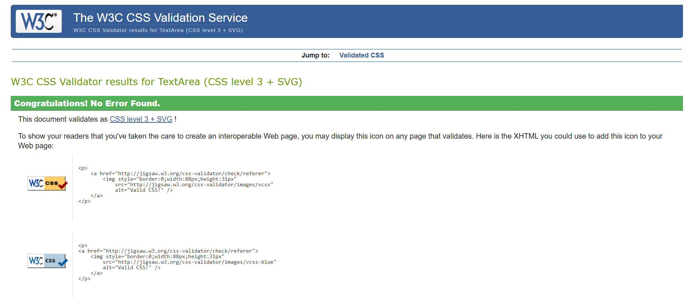

# Testing

This is the TESTING file for the [Post It](https://post-it-project-a1c97a5ab437.herokuapp.com/) website.

Return back to the [README.md](README.md) file.

## Testing Contents  
  
- [Testing](#testing)
  - [Testing Contents](#testing-contents)
  - [Validation](#validation)
    - [HTML Validation](#html-validation)
    - [JavaScript Validation](#javascript-validation)
    - [Python Validation](#python-validation)
    - [CSS Validation](#css-validation)
    - [Lighthouse Scores](#lighthouse-scores)
    - [Wave Accessibility Evaluation](#wave-accessibility-evaluation)
  - [Manual Testing](#manual-testing)
    - [User Input/Form Validation](#user-inputform-validation)
    - [Browser Compatibility](#browser-compatibility)
    - [Testing User Stories](#testing-user-stories)
    - [Dev Tools/Real World Device Testing](#dev-toolsreal-world-device-testing)
  - [Bugs](#bugs)
   - [Known bugs](#known-bugs)

## Validation

### HTML Validation

I used [HTML W3C Validator](https://validator.w3.org) to validate all of the HTML files.

Due to using Jinja syntax such as ' we had to use a different approach to checking the HTML as the validator would show errors if copying the HTML direct from the files in the Playpoint project. The method used to check the HTML was as follows:

- Using the deployed version from Heroku I navigated to each page.
- Right clicking on the page brought up a options menu with the option to view the page source located at the bottom.
- The complete HTML code for that page will then appear in a separate window.
- Copy that code and paste into the [validate by input](https://validator.w3.org/#validate_by_input) option.
- Check for errors and warnings, fix any issues, and then repeat the steps to revalidate.

 

All HTML pages were validated and pages received a 'No errors or warning to show' result as shown above.

| HTML source Code/Page | Errors | Warnings |
|-----------------------|--------|----------|
| index.html         | 0      | 0        |
| base.html (header.html and footer.html included)            | 0      | 0        |
| Register              | 0      | 0        |
| Log in                | 0      | 0        |
| Log out               | 0      | 0        |
| profiles                | 0      | 0        |
| add review                  | 0      | 0        |
| edit review                 | 0      | 0        |
| review confirm delete               | 0      | 0        |
| review detail               | 0      | 0        |
| reviews (review library)                | 0      | 0        |

### JavaScript Validation

[JSHint](https://jshint.com/) was used to validate the small amount of JavaScript code added to the project. External JS, for Bootstrap purposes, obtained via [CDN](https://cdn.jsdelivr.net/npm/bootstrap@5.0.1/dist/css/bootstrap.min.css) was not validated through JSHint.

Comments.js:

 

### Python Validation

[CI Python Linter](https://pep8ci.herokuapp.com) was used to validate the Python files that were created. No issues presented. Screenshots have been included with the results below.

| App folders (.py files) | Errors | pep8 compliant |
|-----------------------|--------|----------|
| app_blog        | 0      | Yes        |
| home            | 0      | Yes     |
| profile              | 0      | Yes        |
| playpoint              | 0      | Yes        |

 

Sign out - registered users

### CSS Validation

[W3C CSS Validator](https://jigsaw.w3.org/css-validator/) was used to validate my CSS files. External CSS for Bootstrap, provided by [CDN](https://cdnjs.cloudflare.com/ajax/libs/bootstrap/5.3.3/css/bootstrap.min.css) was not tested. 

All CSS files were tested and had no syntax errors

  

 

### Lighthouse Scores

Lighthouse testing was carried out in Incognito mode to acheive the best result. Performance was lower than preferred due to the site being image heavy. Static images used in the sites design were saved in webp. Image types added by a site admin are at there own discretion and could affect the score. The CDNs used for Bootstrap were also noted in the Lighthouse report as causing issue with performance. This report will be reviewed for future development of Playpoint to raise this score.
  

*Desktop Paginated Blogs Page*

*Desktop Blog Post Page*  

*Desktop Blog Post Page*
  

### Wave Accessibility Evaluation 

The WAVE report tool was used to check accesability. Some contrast errors were reported in the nav and foot element but it was felt that the colour scheme should remain to match the overall aesthetic.

## Manual Testing

### User Input/Form Validation

Testing was carried out on desktop using a Chrome browser to ensure all forms take the intended input and process the input appropriately.

| Feature                             | Tested? | User Input required                   | User Feedback Provided                                                                                                                              | Pass/Fail | Fix |
|-------------------------------------|---------|---------------------------------------|-----------------------------------------------------------------------------------------------------------------------------------------------------|-----------|-----|
| Navbar                              | Yes     | Click                                 | The user is directed to the specific page as intended one each nav link                                                                                             | Pass      | -   |
| Django messages                              | Yes     | Finish required action                                 | The user is notified when they have completed an action (i.e creating or editing a review), all django messages are working on the website                                                                                            | Pass      | -   |
| Register Page                       | Yes     | Username/Password and Email is mandatory | Empty username ,email and password fields prompt the user.  too similar, password too short, username needs to be more than 8 characters. User is notified when account has been successfully created  | Pass      | -   |
| Login                               | Yes     | Username and Password                 | Username and Password must be exactly as originally registered. User notified once successfully signed in.                                          | Pass      | -   |
| Logout                               | Yes     |   press the sign out button             | logout message popup shown       |    Pass      |   
| create review field (Registered User)       | Yes     | Text input,image,title,genre etc accepted and required                   | User is notified with review created    |    Pass      |   
| edit and delete review field (Registered User)       | Yes     |  for edit, the same input fields are shown for user to ammend and for delete, a modal is shown for user to decide if they are sure to delete the review                   | User is notified when review is edited or deleted   |    Pass      |         
| Comment Box (Registered User)       | Yes     | Text input accepted                   | User is notified with comment made comment                                                                                                                   | Pass      | -   |
| Edit Comment (Registered, user)   | No     | Click button to choose Edit           | Comment appears in comment box for update and update button appears underneath. When pressed the user is infomred that the comment has been updated | Fail      | -   |
| Delete Comment (Registered, user) | Yes     | Click button to choose Delete comment | A [modal](documentation/testing-images/delete-comment-modal.png) will appear asking the user if they are sure they want to delete their comment                      | Pass      | -   |
| profile editing                               | Yes     | Click on edit profile and fill out required fields                                | The user can personalise their profile by adding their name bio and personal profile picture, they can also view any personal game reviews they have made.                                                                                           | Pass      | -   |
| review list pagination                              | Yes     | Click on next or previous to see any other review posts in a different page                            | The user is directed to the next or previous page to view reviews that have been paginated and are on a different page (max is 6 reviews per page).                                                                                         | Pass      | -   |

### Browser Compatibility 

Playpoint was tested on the following browsers. New users were created and old users data edited. All features were tested and no issues found:

- Chrome v131.0.6778.86
- Edge v131.0.2903.51

### Testing User Stories 

User Stories are documented in the Playpoint [Github Projects Board](). User Stories are numbered, with Acceptance Criteria and Tasks detailed within. All features were tested to ensure that they provided the user with the expected output and action.

| User Story           | Acceptance Criteria Met?                                          | Tested | Response  | Pass/Fail | Fix |
|----------------------|-------------------------------------------------------------------|--------|-----------|-----------|-----|
| Admin dashboard      | Yes                                                               | Yes    | No issues | Pass      | -   |
| User Authentication  | Yes                                                               | Yes    | No issues | Pass      | -   |
| Admin post, comment and profile creation | Yes                                                               | Yes    | No issues | Pass      | -   |
| User profile creation and editing      |  Yes | Yes    | No issues | Pass      | -   |
| Creating, editing and deleting a review     | Yes                                                               | Yes    | No issues | Pass      | -   |
| Review commenting (creating a comment)    | Yes                                                               | Yes    | No issues | Pass      | -   |
| Updating and deleting a review comment     | Yes                                                               | Yes    | No issues | Pass      | -   |

### Dev Tools/Real World Device Testing

Responsive testing was carrired out using Google Dev Tools on the devices detailed within the below table. Responsiveness was evident on all features throughout all tested devices. Occassionally the page would have to be refreshed as the page would load zoomed in or out on the simualted device.

**Dev Tools Device dimensions Testing**

| Device  dimensions | Feature      | Issue     | Fix         |
|--------------------|--------------|-----------|-------------|
| 320x1173           | All features | No issues | None needed |
|     768x1173               | All features | No issues | None needed |
|     1024x1173          | All features | No issues | None needed |
|   1440x1173         | All features | No issues | None needed |

  
**Dev Tools Device Testing**
| Device           | Feature      | Issue     | Fix         |
|------------------|--------------|-----------|-------------|
| Lenovo ideapad 3 | All features | No issues | None needed |
| Samsung A52      | All features | No issues | None needed |

**Real World Device Testing**
| Device           | Feature      | Issue     | Fix         |
|------------------|--------------|-----------|-------------|
| Lenovo ideapad 3 | All features | No issues | None needed |
| Samsung A52      | All features | No issues | None needed |

## Bugs

| No. | Bug                                  | Solved | Fix                                                                       | .  
|-----|--------------------------------------|--------|---------------------------------------------------------------------------|------------|
| 1   | Edited comments required approval    | Yes    | Amend cooment_edit to comment.approved = True                             | 
| 2   | Removing remember me from sign up field  |  Yes    |    Use dev tool to copy the id of the crispy form template and put it into css and input display none to make it disappear| 
| 3   |  django messages for delete review not showing    | Yes    |  Using successmessages import plugin on views instead of normal messages import                                      | 
| 4   | Social auth removed from database            | Yes    | New database created from CI database maker and added onto env.py

## Other Bugs

- During the start of the project I encountered a bug within heroku during deployment where i would receive an application error, This was solved with the help of John Rearden (coding Coach) as all I had to do was to create a new app in heroku and connect the github repository onto the new app and deploy it, this then solved the issue as I no longer had the application error.

